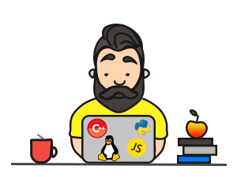

<h1>Welcome to my github page👋</h1>

	</img>
	

    
    
  

  

<h2><a href="https://github.com/syrovezhko/notes">notes</a></h2>

it's just for my sake of convenience

<h2>Let me introduce myself</h2>
<ul>
	<li>my name is Nikolai;</li>
	<li>I'm from Krasnodar, Russia;</li>
	<li>I've graduated Moscow Aviation Institute;</li>
	<li>my major is airplane and helicopter structural designing;</li>
	<li>worked as an aerospace engineer till mid of 2018;</li>
	<li>I'm a 3D design (CAD) and computer science teacher since 2017;</li>
	<li>since 2020 start to learn web-development by myself.</li>
</ul>
<h2>Check out my projects</h2>

<ul><h4>My first project:<a href="https://github.com/syrovezhko/bootstrap_4_test/blob/master/README.md#bootstrap_4_test"> computer science clubs website</a></h4>
	It allowed me:
	<li>to post hometasks</li>
	<li>to post lessons records</li>
	<li>to provide datasheets</li>
	<li>to provide student's books</li>
	<li>to share my repl</li>
	<li>to get completed hometasks via Google forms</li>
</ul>

<ul><h4>My second project: <a href="https://github.com/syrovezhko/django_training_website">django study project</a></h4>
	<h5><i>It's just begun. Don't judge me too harshly</i></h5>
	<li>decomposed template</li>
	<li>added simple CMS (slider)</li>
	<li>added CRM for orders, order's comments and status control</li>
	<li>added telegram's notification bot and controller app for it</li>
	<li>added price control opportunity</li>
	<li>customize admin panel</li>