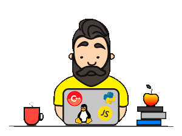

# Сыровежко Николай 👋

	
	

    
    
  

  

<a href="https://github.com/syrovezhko">English</a> | Русский 
<a href="https://github.com/syrovezhko/learn-react#learnreact">Блог про мое изучение React</a>

---

## Обо мне:

*Коротко:*

- окончил Московский Авиационный Институт (Самолето- и вертолетостроение)
- инженер аэрокосмической промышленности (2014 - 2018)
- учитель информатики (2017 - по сей день)
- с 2020 самостоятельно изучаю web-разработку
- с марта 2022 учусь в The Rolling Scopes School

## Подробнее

Меня зовут Николай. Я junior frontend developer.

В 2018 г я закончил Московский Авиационный Институт по профессии инженер по самолето - и вертолетостроению. Я работал по профессии со студенчества. 

После 3х лет работы в промышленности сменил сферу деятельности, стал учителем. Сделать первые шаги в этом направлении меня пригласил научный руководитель.

Звучит странно, не так ли? Зачем нанимать инженера на роль учителя? Ответ прост - каждая московская школа нуждается в инженере с безумными идеями и способностью к преподаванию. Моя задача - придумать инженерный проект и реализовать его с командой школьников. 

Работа в школе дала мне возможность попробовать многие IT направления. Я изучил основы Python и C++.  Научился работать с Arduino и программировать микроконтроллеры через SPI-интерфейс. Попробовал себя в роли DevOps, FrontEND и BackEND разработчиков. Создавал [IoT](https://grabcad.com/library/convector-patriot-pt-c-15-x-v41-1), [hardware&software](https://github.com/syrovezhko/developer-keyboard)  проекты. Школа дала мне возможность выбрать то, что приносит максимум удовольствия. Да, это frontend. 

Я начал с того, что сделал сайт для своих кружков. Это был простой [многостраничник](https://syrovezhko.github.io/bootstrap_4_test) на Bootstrap с ручным обновлением данных. В разработке использовал SASS в связке с Gulp.

На текущий учебный год (2021-2022) я подготовил сайт с использованием Django 3. Я задумывал это как частный бизнес. Однако, проект провалился на старте из-за ошибок в  маркетинге. Тем не менее, вы все равно можете взглянуть на [проект](https://github.com/syrovezhko/platform).

По рекомендации знакомого синьер-разработчика [Владислава Хорева](https://www.linkedin.com/in/vladislav-khorev-63a84450) из Luxoft Russia, я начал осваивать Vue.js и сделал свое первое FullStack веб-приложение. Я использовал Vue.js, Express.js, SqLite DB. Как и с другими проектами, [можете взглянуть](https://syrovezhko.github.io/tab-tracker/client/dist).

Ранее я помогал ему с бекапом GitLab. Это была моя  DevOps-стажировка. Её целью были поднятие Ubuntu-сервера и развертывание на нем GitLab бекапа. Бекап был сделан в устаревшей 8.15.2 версии. Что бы его распаковать, необходимо было использовать версию GitLab не старше 9-ой. Это стало проблемой: на официальном сайте не было версии младше чем 13.12. Но я нашел выход из положения - Docker контейнер. Распаковав контейнер, я накатил бекап и начал обновлять систему шаг за шагом. Машина была в базовой конфигурации. Обновление заняло несколько дней. Под конец, я сделал бекап в последней версии GitLab и отправил его на Amazon облако.

Во время работы, мы приняли решение, что Gitea лучше подходит для задач хранения закрытых репозиториев. По этому, следующей задачей стало поднятие нового Ubuntu-сервера, установка и настройка Gitea, а так же миграция репозиториев из GitLab в Gitea. Это было гораздо проще: инструкции из официальной документации + [скрипт](https://github.com/h44z/gitlab_to_gitea) на python.

В итоге, я сделал бекап Gitea, как и в прошлый раз, закинул его на Amazon облако и снес обе системы. [Владислав](https://www.linkedin.com/in/vladislav-khorev-63a84450) удалил все машины и дал доступ к новой, где я уже по-нормальному установил Gitea и накатил бекап.

В тот момент наткнулся на  The Rolling Scopes School. Думаю, это лучшая возможность для моего самообразования. Проект улучшает и укрепляет мои знания день ото дня. Уверен, что готов к новым испытаниям и проектам

Вот такая история.

Спасибо за внимание!

---

## Мои проекты
**В качестве разработчика**
- ***[мемный слайдер](https://syrovezhko.github.io/cssMemSlider/cssMemSlider/index.html)*** (HTML/CSS only)
- ***[сайт для кружков](https://syrovezhko.github.io/bootstrap_4_test/)*** (HTML/Sass/Gulp/Bootstrap)
- ***[сайт для кружков 2.0](https://github.com/syrovezhko/platform)*** (Python 3/Django 3/Bootstrap)
- ***[виртуальная клавиатура](https://syrovezhko.github.io/virtual-keyboard/dist/)*** (vanilla JS via webpack)
- ***[управление музыкой](https://github.com/syrovezhko/tab-tracker)*** (Vue/Express/SQLite/Bootstrap)

**В качестве наставника**

- ***[клавиатура "истинного" разработчика](https://github.com/syrovezhko/developer-keyboard)***
- ***[умный обогреватель DIY](https://grabcad.com/library/convector-patriot-pt-c-15-x-v41-1)***

---

## Навыки:
**Языки**

&nbsp;
&nbsp;
&nbsp;
&nbsp;
&nbsp;
&nbsp;

**Модули**

&nbsp;
&nbsp;
&nbsp;

**Фреймворки**

&nbsp;
&nbsp;
&nbsp;

**Базы данных**

&nbsp;
&nbsp;
&nbsp;

**Инструменты**

&nbsp;
&nbsp;
&nbsp;
&nbsp;

**Методы**

BEM, ES6, DRY, KISS, YAGNI

---

## Опыт:

### Опыт в DevOps
* **Стажёр**  
***[Fish Run Games](https://www.linkedin.com/in/vladislav-khorev-63a84450)***  
Сентябрь 2021 - Ноябрь 2021

### Опыт разработки
* Образовательная [платформа](https://github.com/syrovezhko/platform) на Django 3 для моих кружков
* [Сайт](https://github.com/syrovezhko/bootstrap_4_test) на Bootstrap для моих кружков
* Первый учебный [проект](https://github.com/syrovezhko/tab-tracker) на vue.js

### Опыт вне IT

* **Преподаватель информатики и инженерного дела**  
***Школа №1288, Москва***  
Сентябрь 2019 - По сей день

* **Преподаватель робототехники**  
***ГБОУ ДО ЦДТ "Строгино"***  
Сентябрь 2017 - Сентябрь 2019

* **Инженер-конструктор**  
***Авиационный Комплекс им. С.В. Ильюшина***  
Ноябрь 2016 - Сентябрь 2018

* **Техник-конструктор**  
***RUSSIAN AIRCRAFT CORPORATION MiG***  
Dec 2014 - Ноябрь 2015

* **Техник-конструктор**  
***JSC “Saturn”***  
Июль 2014 - Август 2014

---

## Образование

* **Московский Авиационный Институт (Национальный Исследовательский Университет)**  
***Инженер-конструктор (Самолето и вертолетостроение)***  
Сентябрь 2012 - Январь 2018

* **Национальный исследовательский технологический университет «МИСиС»
(НИТУ «МИСиС»)**  
***повышение квалификации (Искусственный интеллект: теория и методика обучения в основной школе)***  
Сентябрь 2021 - Декабрь 2021

---

## Знания языков

* Русский - родной
* Английский - B2
* Китайский - A0

---

## Контакты:
* Telegram: [@NIKOLASHA_NUMBER_ONE](https://t.me/NIKOLASHA_NUMBER_ONE)
* WhatsApp: [+7 (985) 289 55 74](https://wa.me/79852895574)
* Phone: [+7 (985) 289 55 74](tel:+79852895574)
* E-mail: [syrovezhko@list.ru](mailto:syrovezhko@list.ru)
* LinkedIn: [Nikolai Syrovezhko](https://www.linkedin.com/in/nikolai-syrovezhko/)

---

## Подтверждение навыков владения Английским

<b>О себе в видео формате</b> (кликните для просмотра👇)

### Статистика:

